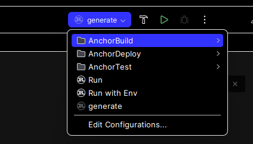

---

#  Solana Anchor Template Optimized for RustRover (Ubuntu)

This is a **cargo generate** template for developing Solana programs using the Anchor framework, optimized for **IntelliJ RustRover** on **Linux Ubuntu**. It provides a fully-configured development environment with ready-to-use run configurations, Rust toolchains, and build/test workflows.

## Overview

This template is designed to help developers quickly set up and start building Solana programs using the **Anchor framework** within **IntelliJ RustRover** on **Linux Ubuntu**. It includes pre-configured tools for building, testing, deploying, and formatting Rust-based Solana programs.

### New Features Added

- **Pre-configured Run Configurations** for quick access to building, testing, and deploying the program.
    - **Anchor Build**: For compiling the Solana program.
    - **Anchor Test**: To run your tests.
    - **Anchor Deploy**: For deploying the program to a cluster (e.g., Devnet).
    - **Run with Environment Variables**: Customized configuration to set up environment variables for the Solana cluster and wallet path.

## Features

- 🚀 **Pre-configured Anchor Framework** for Solana smart contract development.
- 🛠 **IntelliJ RustRover Optimized**: IntelliJ run configurations for building, testing, and deploying Solana programs.
- 🧰 **Rust Toolchains and Cargo Configurations**: Ensuring consistent builds and formats across different environments.
- ✅ **Rust formatting and linting**: Integrated `rustfmt` and `clippy` support to keep your code clean and efficient.

## Prerequisites

Before using this template, make sure you have the following dependencies installed on your **Linux Ubuntu** system:

### 1. Install Rust

Install the Rust programming language using `rustup`, the Rust toolchain installer:

```bash
curl --proto '=https' --tlsv1.2 -sSf https://sh.rustup.rs | sh
source $HOME/.cargo/env
```

Ensure that `cargo` (Rust’s package manager) is available in your terminal by running:

```bash
cargo --version
```

### 2. Install Solana CLI

The **Solana CLI** allows you to interact with the Solana network and deploy programs. To install the Solana CLI tools, run the following commands:

```bash
sh -c "$(curl -sSfL https://release.solana.com/v1.10.31/install)"
```

Add Solana CLI to your environment by adding this line to your `~/.bashrc` or `~/.zshrc`:

```bash
export PATH="$HOME/.local/share/solana/install/active_release/bin:$PATH"
```

Reload your terminal or source your `.bashrc`:

```bash
source ~/.bashrc
```

Verify the Solana CLI installation:

```bash
solana --version
```

### 3. Install Anchor CLI

The **Anchor CLI** provides the necessary tools to develop Solana smart contracts using the Anchor framework. To install it, run the following command:

```bash
cargo install --git https://github.com/coral-xyz/anchor anchor-cli --locked
```

Verify the installation:

```bash
anchor --version
```

### 4. Install cargo-generate

To use this template with `cargo generate`, you need to install **cargo-generate**:

```bash
cargo install cargo-generate
```

Verify the installation:

```bash
cargo generate --version
```

## Quick Start

Once the prerequisites are installed, you can use this template to create a new project.

1. Generate a new project using the template:

   ```bash
   cargo generate --git https://github.com/yourusername/solana-anchor-rustrover-template.git --name {{project-name}}
   cd {{project-name}}
   ```

2. Build the project:

   ```bash
   anchor build
   ```

3. Run tests:

   ```bash
   anchor test
   ```

## Setting Up in IntelliJ RustRover (Ubuntu)

1. **Install IntelliJ RustRover**:
   Download and install IntelliJ RustRover from the [JetBrains website](https://www.jetbrains.com/rust/).

2. **Open the Project**:
   Open the generated project in **IntelliJ RustRover**.

3. **Configure the Rust Toolchain**:
   RustRover should automatically detect the Rust toolchain. If not, go to **Settings > Languages & Frameworks > Rust** and set the toolchain path to `~/.cargo/bin`.

4. **Run Configurations**:
   RustRover includes pre-configured run configurations to simplify development:
    - **Anchor Build**: Builds the Solana program.
    - **Anchor Test**: Runs the test suite.
    - **Anchor Deploy**: Deploys the program to the Solana network.
    - **Run with Env**: A custom run configuration that sets environment variables for the Solana cluster (`ANCHOR_PROVIDER_URL`) and wallet (`ANCHOR_WALLET`).

   You can access these configurations directly from the **Run/Debug** menu in RustRover.

### Run Configuration Example



The run configurations are visible directly in the IDE, offering quick access to build, test, deploy, and custom environment variable runs.

## Running the Project

Once everything is set up, you can use the following commands to build, test, and deploy your Solana program.

- **Build the project**:
   ```bash
   anchor build
   ```

- **Run tests**:
   ```bash
   anchor test
   ```

- **Deploy the program** (optional):
  If you want to deploy the program to a Solana cluster (e.g., `devnet`), use the following command:

   ```bash
   anchor deploy --provider.cluster devnet
   ```

## Formatting and Linting

This template is pre-configured with Rust's formatting and linting tools. You can use these commands to keep your code clean and optimized:

- **Format your code** using `rustfmt`:
   ```bash
   cargo fmt
   ```

- **Lint your code** using `clippy`:
   ```bash
   cargo clippy
   ```

## Troubleshooting (Ubuntu Specific)

### 1. Permissions Issues

If you encounter any permissions issues while installing or running commands, prepend the command with `sudo`:

```bash
sudo anchor build
```

### 2. PATH Issues

If your terminal doesn’t recognize commands like `solana`, ensure that the **Solana CLI** path is added to your shell configuration file (`~/.bashrc` or `~/.zshrc`). Then, reload the terminal:

```bash
source ~/.bashrc
```

### 3. Missing Dependencies

Ensure you have installed all necessary libraries, including `libssl-dev`, `pkg-config`, and `build-essential`:

```bash
sudo apt-get update
sudo apt-get install -y build-essential libssl-dev pkg-config
```

## License

This project is licensed under the MIT License. See the [LICENSE](LICENSE) file for more details.

---
